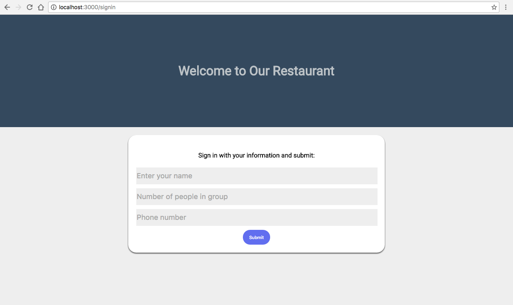

## Inspiration

Traditionally, when customers go to restaurants, they put their names down on a waitlist and hang around the waiting area. If a restaurant was more sophisticated, they might give customers buzzers that allow for some mobility around the restaurant. Now, _Waitlist_ expands the range from the restaurant to virtually the entire world (but realistically the entire local mall).

We were also inspired by a sushi restaurant that adopted a similar approach. 

## What it does

Customers go to the restaurant and sign up on a waitlist. They are enqueued and sent a confirmation SMS message containing a link to the waitlist. Using the link, they are able to view their position and how close they are to enjoying delicious food. Customers are also able to edit their entry and change fields such as the number of people.

## How we built it

We went off on what we learned from the Web Dev workshop by using that knowledge as a jumping board for our application.

## Challenges we ran into

Half of our team had no Web Dev experience, so we all had to get on the same page first before starting.

## Accomplishments that we're proud of

Instead of staying up all night and becoming increasingly unproductive, we got sleep and started the day ready to work. We were able to go from learning backend and frontend from the work shop to developing a rudimentary version of our vision. This is also the first time we successfully finished a project for a Hackathon.

## What we learned

We learned a lot about Web Dev.

## What's next for Waitlist

We hope to implement features that we were not able to implement during this Hackathon such as allowing customers to remove themselves from the waitlist. Potentially, we hope to reach out to local restaurants and see if they would be willing to adopt our product. Ultimately, we also hope to solve some issues that surround busy restaurants that could potentially be hazards.
